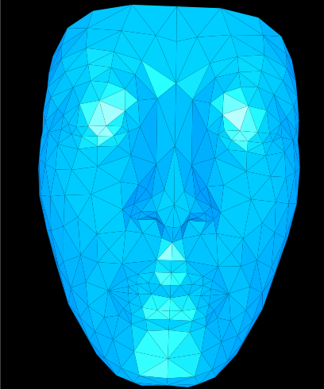

# EPS2IMG v. 1.0

## About

This program converts an EPS file to PDF. This is a proof-of-concept project and is currently a work in progress.
Only a subset of the PostScript programming language is currently implemented, with over 140 operators supported; so don't expect to 
convert every PS/EPS file you have. Also, only the 13 original base fonts are currently supported.

For a list of supported operators, check out the files _operator_id.h_ and _system-dictionary.cpp_.

## Compilation

To compile the program, you need the Cairo graphics library, which includes some dependencies. Two DLLs (_cairo.dll_ and _pixman.dll_) and an executable (_EPS2IMG.EXE_) 
(all 32 bits) are provided for your convenience.

## Copying

This program is released under the GNU General Public License
version 3 or newer. See the COPYING file included with this distribution or
<http://www.gnu.org/licenses/>.

	Copyright (c) 2020 Peter Frane Jr.

## Contact

For licensing, additional features, and bug reports, please contact the author at pfranejr AT hotmail.com

## Samples

EPS2IMG is good enough to convert the samples below. (Note: These images were cropped.)

The well-known PostScript tiger. Credit to the original author(s).

Doretree. Original author: Jesse Don Hickson III. Public-domain file.

Nefertiti. The original file can be found here: <https://www.codeproject.com/Articles/909/Achieving-PostScript-and-Wmf-outputs-for-OpenGL>

